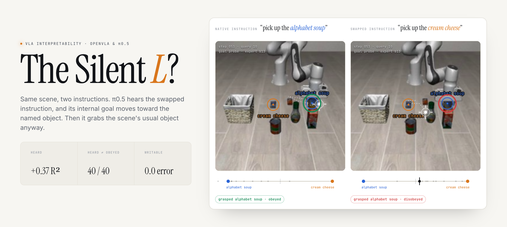
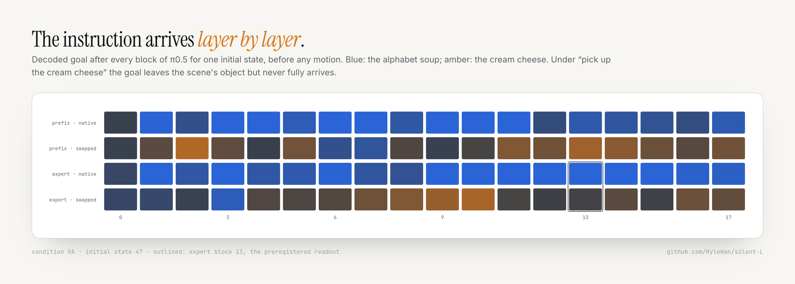
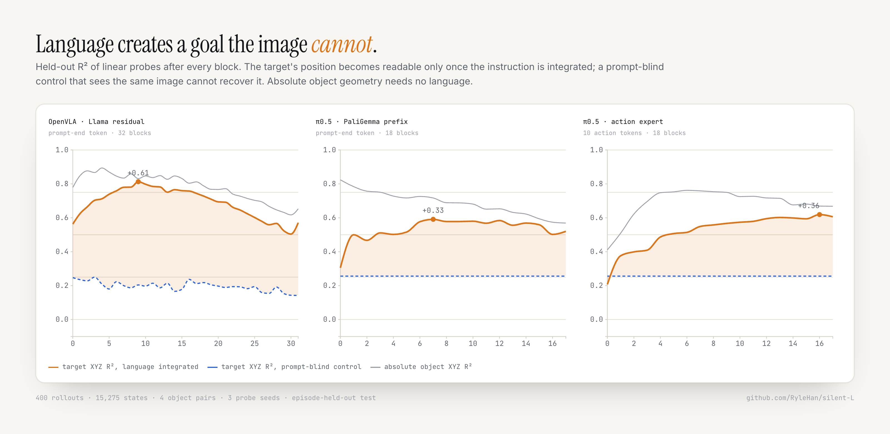
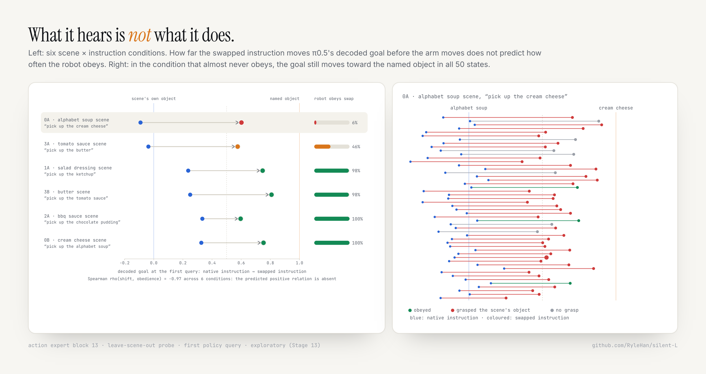
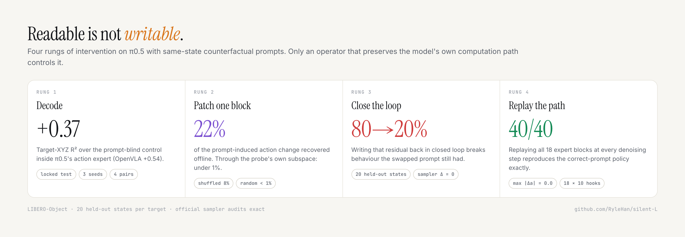

<p align="center">
  <a href="https://rylehan.github.io/silent-L/">
    <picture>
      <source media="(prefers-color-scheme: dark)" srcset="assets/figures/hero_dark.png">
      
    </picture>
  </a>
</p>

<p align="center">
  <a href="https://rylehan.github.io/silent-L/"><b>Interactive explorer</b></a>
  &nbsp;·&nbsp; <a href="docs/research_log.md">Research log</a>
  &nbsp;·&nbsp; <a href="docs/protocols">Preregistered protocols</a>
  &nbsp;·&nbsp; <a href="#reproducing">Reproduce</a>
</p>

# The Silent L?

**π0.5 hears the instruction. What it hears does not decide what it does.**

Vision-language-action models often act on visual shortcuts instead of
language ([LIBERO-Plus](https://arxiv.org/abs/2510.13626),
[LIBERO-CF](https://arxiv.org/abs/2602.17659),
[LangGap](https://arxiv.org/abs/2603.00592)). Those benchmarks see the
behaviour. They cannot say whether the model **failed to hear** the
instruction or **heard it and acted on something else**.

This project separates the two with one exact counterfactual: the same
simulator state, the same robot state, the same flow-matching noise, and two
instructions that name different objects. Anything that differs between the
two forward passes is caused by language. We follow it from the language model,
through π0.5's action expert, to the gripper, in OpenVLA-7B and π0.5 on
LIBERO-Object.

<sub>4 object pairs · 8 tasks · 15,275 cached states · 600 closed-loop compliance rollouts, each replayed under read-only capture · 13 preregistered stages, every outcome kept</sub>

## Findings

| | Finding | Evidence |
|---|---|---|
| **Heard** | The instruction creates a goal-centric state that a prompt-blind readout of the same image cannot recover, and it reaches the action expert. | Target-XYZ R² over the prompt-blind control: OpenVLA **+0.54**, π0.5 prefix **+0.33**, π0.5 action expert **+0.37** |
| **Obeyed** | Obedience to a swapped instruction depends on the scene, not the words. | 6% / 98% / 100% / 46% across four object pairs; the two failing pairs obey 100% / 98% in the opposite scene |
| **Heard ≠ obeyed** | Before the arm moves, the instruction pulls the decoded goal toward the named object even when the robot then grasps the other one, and the size of that pull does not predict obedience. | **40/40** wrong-object rollouts shift toward the named object (0.40–0.70 of the object distance); shift vs obedience across six conditions ρ = −0.97, the opposite of the predicted sign |
| **Writable** | The decoded goal is not a control handle. Only interventions that preserve the model's computation path control it. | One-block patch: 22% local action recovery, <1% through the probe subspace, closed loop 80% → 20%. Full 18-block replay: **40/40**, max action error **0.0** |

## The instrument

<picture>
  <source media="(prefers-color-scheme: dark)" srcset="assets/figures/tomography_dark.png">
  
</picture>

- **Paired prompts.** Every image is evaluated under both instructions with
  identical robot state and noise. Labels are recomputed per prompt: for one
  physical state, "target XYZ" is object A's position under prompt A and object
  B's under prompt B, so a single linear probe must follow the instruction.
- **Read-only hooks.** Post-block residuals are captured from the official
  sampler. Hooked and unhooked actions agree to `0.0`, and every replayed
  rollout reproduces its original outcome exactly.
- **Probes that never saw the states.** The goal probes used on closed-loop
  rollouts are refit with the evaluated scene left out. A probe that had seen
  those states would have reported 39/40 instead of 23/29
  ([Stage 12](docs/protocols/stage12_probe_read.md)).
- **Prompt-blind controls.** OpenVLA's mean visual residual and π0.5's SigLIP
  tokens before any language block are asserted identical across the two
  prompts.

## 1 · Heard

<picture>
  <source media="(prefers-color-scheme: dark)" srcset="assets/figures/heard_dark.png">
  
</picture>

Absolute object and robot positions are equally readable with or without
language; they are in the image. The target's position becomes readable only
once the instruction is integrated. On unseen object pairs (leave-one-pair-out)
the backbone maps do not transfer (OpenVLA −0.35, π0.5 prefix −0.31), while the
action expert does best (target displacement +0.11, positive on 4/4 pairs):
the most shared goal-relative code lives closest to the action.

## 2 · Obeyed

Unmodified π0.5, all 50 official initial states per scene, native versus
swapped instruction, first object grasped
([Stage 11](docs/research_log.md#stage-11-multi-pair-instruction-compliance-gate)):

| Pair | Native instruction | Swapped instruction | Swapped, opposite scene |
|---|---:|---:|---:|
| alphabet soup / cream cheese | 98% | **6%** (80% grasp the scene's object) | 100% |
| salad dressing / ketchup | 98% | 98% | — |
| bbq sauce / chocolate pudding | 100% | 100% | — |
| tomato sauce / butter | 100% | **46%** (50% grasp nothing) | 98% |

π0.5 can read both object names in both scenes. It fails on particular
instruction–scene combinations, so no universal "VLAs ignore language" claim
is made.

## 3 · Heard is not obeyed

<picture>
  <source media="(prefers-color-scheme: dark)" srcset="assets/figures/obeyed_dark.png">
  
</picture>

**Stage 12 (preregistered): inconclusive.** On the 40 rollouts where π0.5
grasps the wrong object, the primary goal probe points at the instructed
object in 23/29 determinate reads (0.79, 95% CI [0.62, 0.90]), short of the
0.70 threshold, and a leave-pair-out probe points the other way (10/30).
[Protocol, amendment and audits](docs/protocols/stage12_probe_read.md).

**Exploratory, robust across probes:** in all 40 of those rollouts the swapped
instruction moves the decoded goal toward the named object, by 0.40–0.70 of the
object distance, before any motion.

**Stage 13 (exploratory, analysis fixed in advance): the predicted relation is
absent.** Across all six scene × instruction conditions, a larger shift does
not go with more obedience (ρ = −0.97; with one probe shared across the two
scenes of a pair the sign flips), so the size of the instruction's pull on the
decoded goal does not predict what the robot does.
[Protocol and results](docs/protocols/stage13_language_shift.md).

Three independent observations agree: the probe subspace carries under 1% of
the instruction's causal effect on the action (Stage 5); with an
underspecified instruction the internal default and the behavioural default
disagree (Stage 7); and the decoded goal moves toward the named object whether
or not the robot obeys (Stages 12–13). The linear goal state is a faithful
record of what was said. Object selection runs through something it does not
capture.

A post-hoc observation, not yet tested: in the two failing scenes the
native-instruction goal sits squarely on the scene's own object (−0.09 and
−0.04 on the object axis), while in the four obeying scenes it already leans
0.24–0.33 toward the other object.

## 4 · Writable

<picture>
  <source media="(prefers-color-scheme: dark)" srcset="assets/figures/writable_dark.png">
  
</picture>

| Intervention on π0.5 (target switching) | Offline | Closed loop |
|---|---|---|
| Natural counterfactual residual, expert block 13 | 21–23% of the prompt-induced action change | target A success 80% → 20%; target B stays 0% |
| …restricted to the rank-30 probe goal subspace | 0.4–0.7% | — |
| …with that subspace removed | 21–22% | — |
| Episode-shuffled / norm-matched random | 8% / < 1% | no change |
| **Replay all 18 expert blocks at all 10 denoising steps** | max action error **0.0** | **40/40**, identical to the correct prompt |
| COAST-style soft conceptor gate (LIBERO-10 KS3, 30 held-out states) | — | 40% → 53%, 95% CI [−3.3, +30.0] pp |

A reproduction of the released FFN steering cluster of
[Häon et al.](https://arxiv.org/abs/2509.00328) was valid at the hook level but
did not reproduce its directional effect on this stack (Stage 6).

## The ledger

Every stage had its question, endpoint and stopping rule written down before
it ran.

| Stage | Question | Outcome |
|---|---|---|
| 1 | Relative (TARGET / ALTERNATIVE) vs absolute object coordinates, OthelloGPT-style | negative: −0.003 F1 |
| 2–4 | Goal-centric state in OpenVLA, the π0.5 prefix, the π0.5 action expert | positive |
| 5 | One-block counterfactual patching | local 22%, not via the probe subspace; closed loop fails |
| 6 | Published FFN steering cluster | not reproduced |
| 7 | Underspecified instruction: one internal default target? | no; follow-up not admitted |
| 8 | Full expert-pathway replay (operator positive control) | passed: error 0.0, 40/40 |
| 9 | Soft conceptor gate | positive point estimate, CI crosses zero |
| 10 | Four-pair confirmation and leave-pair-out | confirmed; generalisation only in the expert |
| 11 | Instruction compliance, four pairs, reciprocal scenes | scene-dependent, 2/4 pairs fail |
| 12 | Heard but not obeyed at the first query | inconclusive |
| 13 | Does the goal shift predict obedience? | no |

## What this project does not claim

- It is not a learned world model; no multi-step transition prediction is
  tested.
- It does not claim that VLAs ignore language in general; obedience is pair-
  and scene-dependent.
- It does not claim that the decoded goal variables are the mechanism the
  policy uses; Stages 5, 12 and 13 all argue that they are not.
- It does not claim a policy improvement.

## Where this started

The project began by asking whether VLAs, like OthelloGPT's `MINE / YOURS`
board, represent objects more linearly in instruction-relative coordinates
than in absolute identity coordinates. After reproducing the OthelloGPT
reference (best-layer probe accuracy 0.992 relative vs 0.752 absolute), the
matched OpenVLA test found no advantage (relative − absolute foreground F1
−0.0033 [−0.0084, 0.0022]). That negative result opened the broader question
above.

## Related work

| Work | Level | Relation |
|---|---|---|
| [LIBERO-Plus](https://arxiv.org/abs/2510.13626), [LIBERO-PRO](https://github.com/kiwi142857/LIBERO-PRO) | Behaviour | VLAs are largely insensitive to instruction changes |
| [LIBERO-CF / CAG](https://arxiv.org/abs/2602.17659) | Behaviour + guidance | Counterfactual instructions; vision overrides language |
| [LangGap](https://arxiv.org/abs/2603.00592) | Behaviour + data | Same-scene multi-task benchmark; augmentation partly closes the gap |
| [Grant et al.](https://arxiv.org/abs/2603.19233) / [Action Atlas](https://action-atlas.com/) | Mechanism | Visual pathway dominance across six VLAs; language matters when scenes are ambiguous |
| [Emergent world representations in OpenVLA](https://arxiv.org/abs/2509.24559) | Representation | World state is linearly decodable in OpenVLA |
| [DR.VLA](https://arxiv.org/abs/2603.19183), [Häon et al.](https://arxiv.org/abs/2509.00328), [COAST](https://arxiv.org/abs/2605.17144) | Steering | Sparse features, FFN steering, conceptor steering |
| [Decoding task progress](https://arxiv.org/abs/2608.13474) | Representation | A readable progress signal that does not steer behaviour |

What this project adds: a same-state, same-noise paired-prompt control at the
representation level; goal probes that never saw the evaluated states; a
direct comparison between what the goal state says and what the robot does, on
the same rollouts; and an intervention ladder with an exact operator positive
control.

## Repository

```text
vla_coordinates/   runtimes and hooks: OpenVLA residuals, pi0.5 prefix/expert capture,
                   paired patching, full-path replay, conceptor gate, stored goal probes
scripts/           data generation, extraction, probes, bootstraps, closed-loop evaluation,
                   summaries, explorer export, figure rendering
configs/           frozen object-pair configuration
cluster/           Slurm jobs and environment scripts used for every run
artifacts/         locked summaries, metrics and figures per stage
docs/              research log (Stages 1–11) and preregistered protocols (Stages 12–13)
site/              the interactive explorer (static; deployed to GitHub Pages)
assets/figures/    README figures, rendered from site/figures.html
tests/             unit tests for statistics and decision rules
```

### Reproducing

All experiments ran as Slurm jobs on the NHR@FAU TinyGPU cluster. Each stage in
the [research log](docs/research_log.md) and the protocols lists its job files
in order, and every stage has a smoke job.

```bash
git clone https://github.com/RyleHan/silent-L.git && cd silent-L
export VLA_WORK_ROOT=/path/to/large/storage/vla_coordinates  # defaults to $WORK/vla_coordinates
mkdir -p logs                     # or symlink logs -> $VLA_WORK_ROOT/logs
bash cluster/setup_pi05_env.sh    # pi0.5 environment and checkpoint conversion
sbatch cluster/jobs/eval_pi05_stage12_probe_read_smoke.sbatch   # submit from the repo root
```

The `cluster/env_*.sh` scripts resolve the project root from their own location
and read `VLA_HOME_ROOT` (default `$HOME`, holding the LIBERO and vendor
checkouts) and `VLA_WORK_ROOT`. Partition names in job headers are
TinyGPU-specific.

### Explorer and figures

```bash
python3 scripts/serve_site.py      # http://127.0.0.1:8765, with HTTP range support for video seeking
npm install && npm run figures     # re-render assets/figures/*.png with local Chrome
```

`scripts/export_explorer_data.py` rebuilds `site/data/` from the cluster runs.

## Citation

```bibtex
@misc{silentl2026,
  title        = {The Silent L? Paired-Prompt Probing of Whether Vision-Language-Action Models Hear, Obey, and Can Be Written with Language},
  author       = {RyleHan},
  year         = {2026},
  howpublished = {\url{https://github.com/RyleHan/silent-L}}
}
```
