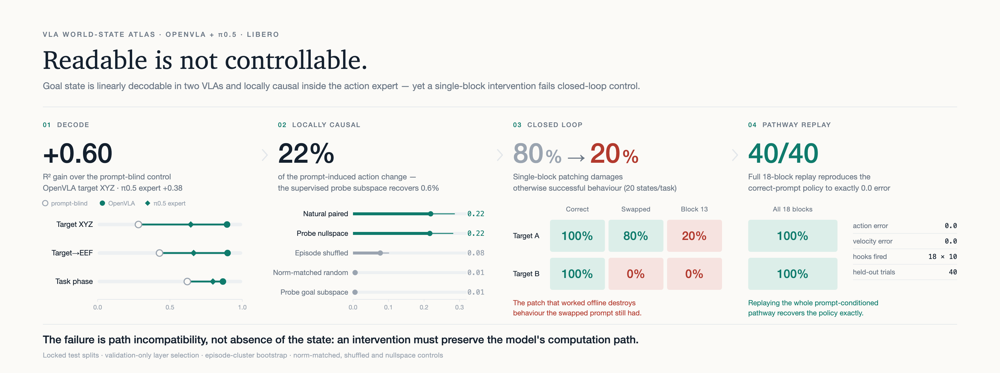
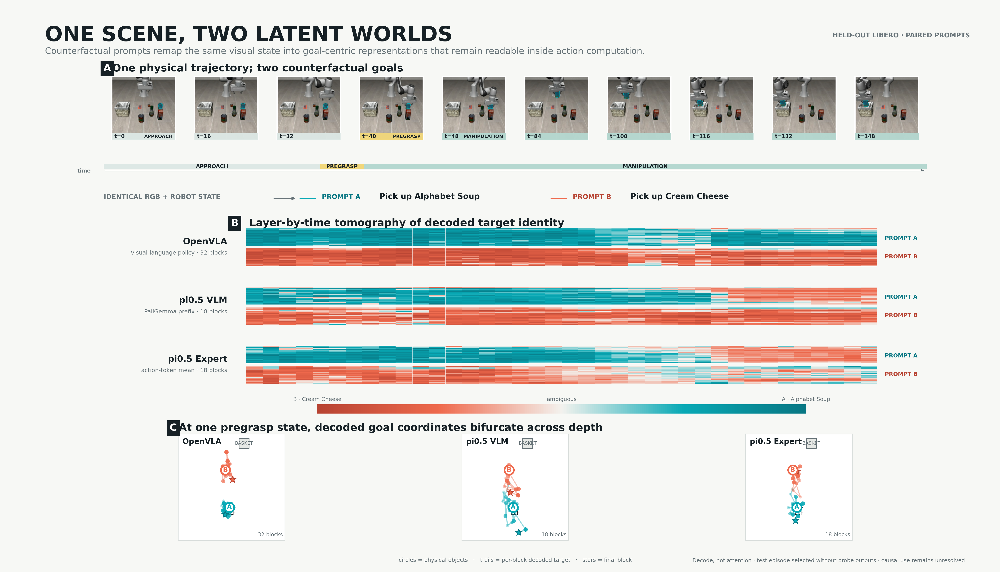
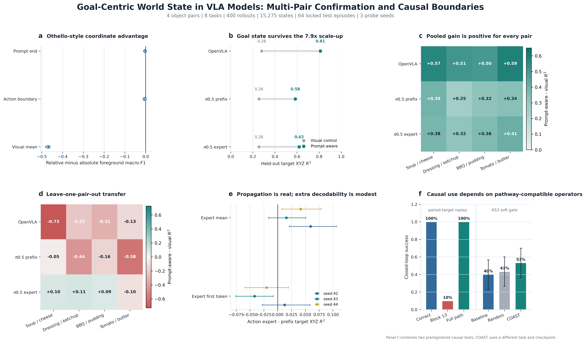
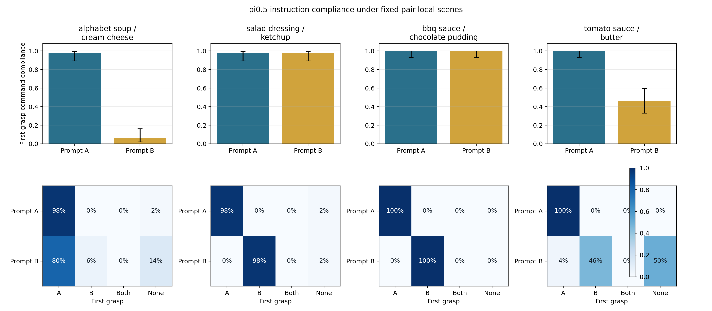
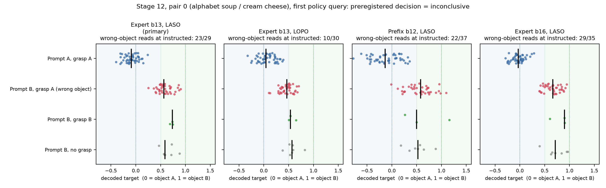
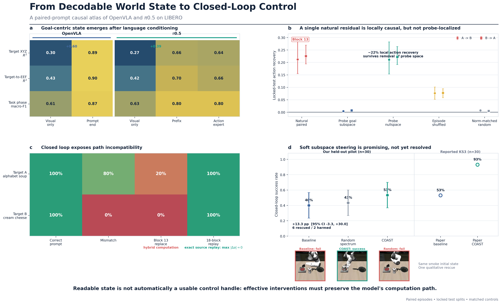

<p align="center">
  <picture>
    <source media="(prefers-color-scheme: dark)" srcset="artifacts/hero/hero_dark.png">
    
  </picture>
</p>

# The Silent L?

**Do vision-language-action models hear the instruction, obey it, and can the
instruction be written back into them?**

> VLAs hear the instruction. They don't always obey it. And you can't just
> write it in.

A growing set of benchmarks shows that VLAs often act on visual shortcuts
instead of language ([LIBERO-Plus](https://arxiv.org/abs/2510.13626),
[LIBERO-CF](https://arxiv.org/abs/2602.17659),
[LangGap](https://arxiv.org/abs/2603.00592)). Those benchmarks measure
behaviour. This project asks where along the pipeline language is lost, using
one exact counterfactual: **the same simulator state, the same robot state, the
same flow-matching noise, and two instructions that name different objects.**
Anything that differs between the two forward passes is caused by language.

The study covers OpenVLA-7B and pi0.5 on LIBERO-Object: 4 object pairs,
8 tasks, 400 rollouts, 15,275 cached states, episode-held-out splits with a
locked test set, three probe seeds, 10,000-sample episode bootstraps, and a
preregistered gate before every causal stage.

## TL;DR

| Question | Answer | Key evidence |
|---|---|---|
| **Heard?** Is the instruction integrated into the model's state? | **Yes.** Both VLAs encode a goal-centric state that is only readable once language is present, and it reaches pi0.5's action expert. | Target-XYZ R² gain over a prompt-blind visual control: OpenVLA **+0.543**, pi0.5 prefix **+0.327**, pi0.5 action expert **+0.366** |
| **Obeyed?** Does behaviour follow it? | **Usually, but not reliably.** Instruction following fails sharply for particular instruction–scene combinations. | Swapped-instruction first-grasp compliance **6% / 98% / 100% / 46%** across 4 pairs; the same failing pairs recover to **100% / 98%** in the opposite scene |
| **Writable?** Can a decoded goal state be used as a control handle? | **Not as a compact axis.** Causal control works only when the intervention preserves the model's own computation path. | One-block patch: **22%** local action recovery, closed-loop success **80% → 20%**. Full 18-block replay: **40/40**, max action error **0.0** |
| **Heard but not obeyed?** On the rollouts where pi0.5 grasps the wrong object, what does its goal state say? | **Preregistered test: inconclusive.** Exploratory: the instruction still moves the decoded goal substantially towards the named object. | Swapping A→B shifts the decoded target towards B in **40/40** wrong-object rollouts (0.40–0.70 of the A–B distance); the discrete read gives 23/29 (primary) vs 10/30 (second probe) |

## The instrument: one scene, two instructions



```text
same RGB + same wrist image + same robot state + same noise
        |                                   |
 "pick up the alphabet soup ..."    "pick up the cream cheese ..."
        |                                   |
     h(o, p_A)                           h(o, p_B)
```

- Residuals are read with forward hooks after every block: 32 Llama blocks in
  OpenVLA; 18 PaliGemma prefix blocks and 18 action-expert blocks in pi0.5.
- Labels are recomputed per prompt. For one physical state, "target XYZ" is
  object A's position under prompt A and object B's under prompt B, so a single
  linear probe must follow the instruction to fit both.
- The negative control is a **prompt-blind** visual readout: the mean visual
  residual in OpenVLA, and the projected SigLIP tokens before any language
  block in pi0.5. Its features are asserted identical across the two prompts.
- Layers are selected on validation episodes only. Test episodes are read once.

## Q1. Heard: language creates a goal-centric state

Absolute object and robot geometry is equally readable with or without
language, since it is visible in the image. Target-relative geometry is not.

| Readout (Stage 10, 4 pairs, 3 seeds) | Prompt-aware minus prompt-blind, target XYZ R² |
|---|---:|
| OpenVLA prompt end | +0.543 |
| OpenVLA action boundary | +0.495 |
| pi0.5 PaliGemma prefix, prompt end | +0.327 |
| pi0.5 action expert, 10-token mean | +0.366 |
| pi0.5 action expert, first token | +0.311 |

Every row is positive in all three seeds, and every object pair shows a
positive gain for each model's principal readout.

**Where it generalises.** A leave-one-pair-out test trains on three pairs and
tests on an unseen fourth. Backbone target-XYZ maps do not transfer (OpenVLA
−0.348, pi0.5 prefix −0.308). The pi0.5 action expert does best: target XYZ
+0.049 (positive on 3/4 pairs) and target displacement +0.110 (4/4). Pooled
decoding therefore contains substantial pair-specific coding; the most shared
goal-relative abstraction lives in the action expert.



## Q2. Obeyed: compliance depends on the scene

**Stage 11** runs the unmodified pi0.5 policy on all 50 official initial states
of one anchor scene per pair, once with the native instruction and once with
the other object named. There are no hooks and no interventions. The endpoint
is the first object grasped.

| Pair | Native prompt | Swapped prompt | Swapped-prompt first grasp |
|---|---:|---:|---|
| alphabet soup / cream cheese | 98% | **6%** | 80% native object, 6% instructed, 14% none |
| salad dressing / ketchup | 98% | 98% | 98% instructed |
| bbq sauce / chocolate pudding | 100% | 100% | 100% instructed |
| tomato sauce / butter | 100% | **46%** | 4% native object, 46% instructed, 50% none |

The failures do not follow object identity. In the opposite scene, the two
failing pairs obey the swapped instruction 100% and 98% of the time. pi0.5 can
read both object names; it fails on particular instruction–scene
combinations. The preregistered criterion for a general phenomenon (a positive
effect in at least 3/4 pairs) is not met, so no universal "language is ignored"
claim is made.

**Stage 7A** adds an instruction that names no object ("pick up an object and
place it in the basket"). The internal target readouts lean towards object B
(interpolation 0.68 in the prefix and 0.65 in the expert, where 0 = object A
and 1 = object B). Behaviour instead picks the object associated with the
scene's own task in both scenes (80% target grasp). The model's internal
default and its behavioural default disagree.



**Stage 12** asks the question that links Q1 and Q2: when pi0.5 grasps the
wrong object, does its goal state at the first policy query (before the arm
moves) name the instructed object, or the one it is about to grasp? Stage 11
rollouts are replayed under the official sampler with read-only hooks; all 200
outcomes reproduce exactly and hooked actions match unhooked ones to 0.0. The
probes never saw these initial states.

- **Preregistered result: inconclusive.** On 40 wrong-object rollouts, the
  primary probe points at the instructed object in 23/29 determinate reads
  (0.79, 95% CI [0.62, 0.90]), short of the 0.70 lower-bound threshold, and a
  second probe (leave-pair-out) points the other way (10/30).
- **Exploratory:** under both probes, and in the PaliGemma prefix, swapping
  the instruction moves the decoded goal towards the named object in every one
  of the 40 wrong-object states, by 0.40–0.70 of the object distance. That
  shift is as large where the policy disobeys as overall. It stops near the
  midpoint, which is why a two-way read is fragile.



Full protocol, amendment, audits, and results:
[docs/protocols/stage12_probe_read.md](docs/protocols/stage12_probe_read.md).

## Q3. Writable: readable is not controllable

| Intervention on pi0.5 (target-switching) | Offline effect | Closed loop |
|---|---|---|
| Natural counterfactual residual, expert block 13 | Recovers 21–23% of the prompt-induced action change | Success on target A drops 80% → 20%; target B stays 0% |
| …restricted to the rank-30 probe goal subspace | 0.4–0.7% recovery | — |
| …with that subspace removed | 21–22% recovery | — |
| Episode-shuffled / norm-matched random controls | 8% / 0.5–0.7% | Random: no change |
| **Full replay of all 18 expert blocks at all 10 denoising steps** | max action error **0.0** | **40/40** success, matching the correct prompt |
| COAST-style soft conceptor gate (LIBERO-10 KS3, 30 held-out states) | — | 40% → 53%, 95% CI [−3.3, +30.0] pp |

1. The prompt-induced residual difference at a single block is locally causal,
   but the variables the probes decode are not what carries the effect.
2. Writing that residual back at one block creates a hybrid computation that
   damages otherwise successful behaviour.
3. Replaying the whole prompt-conditioned expert pathway is an exact positive
   control. The operator can work, but only when it respects the model's
   computation path.
4. A soft subspace gate is promising but underpowered. No policy improvement is
   claimed.

A reproduction of the released FFN steering cluster from
[Häon et al.](https://arxiv.org/abs/2509.00328) (Stage 6) was valid at the
implementation level but did not reproduce its directional effect on this
stack.



## What this project does not claim

- It is not a learned world model; no multi-step transition prediction is
  tested.
- It does not claim that VLAs ignore language in general. Behaviour is
  pair- and scene-dependent.
- It does not claim that the decoded goal variables are the mechanism the
  policy uses. The semantic-subspace ablation says they are not, at block 13.
- It does not claim a policy improvement.

## Where this started: the OthelloGPT hypothesis (negative)

The project began by asking whether VLAs, like OthelloGPT's `MINE / YOURS`
board, represent objects more linearly in instruction-relative coordinates
(`TARGET / ALTERNATIVE`) than in absolute identity coordinates. After
reproducing the OthelloGPT reference (best-layer probe accuracy 0.992 relative
versus 0.752 absolute), the matched OpenVLA test found no advantage: relative
minus absolute foreground macro-F1 is −0.0033 [−0.0084, 0.0022] at the prompt
end. Prompt-aware tokens can relabel by instruction, but relative coordinates
are not a more natural basis. That negative result motivated the broader
goal-state atlas above.

## Related work

| Work | Level | Relation |
|---|---|---|
| [LIBERO-Plus](https://arxiv.org/abs/2510.13626), [LIBERO-PRO](https://github.com/kiwi142857/LIBERO-PRO) | Behaviour | VLAs are largely insensitive to instruction changes |
| [LIBERO-CF / CAG](https://arxiv.org/abs/2602.17659) | Behaviour + guidance | Counterfactual instructions; vision overrides language |
| [LangGap](https://arxiv.org/abs/2603.00592) | Behaviour + data | Same-scene multi-task benchmark; augmentation partly closes the gap |
| [Grant et al.](https://arxiv.org/abs/2603.19233) / [Action Atlas](https://action-atlas.com/) | Mechanism | Visual pathway dominance across six VLAs; language matters when scenes are ambiguous |
| [Emergent world representations in OpenVLA](https://arxiv.org/abs/2509.24559) | Representation | World state is linearly decodable in OpenVLA |
| [DR.VLA](https://arxiv.org/abs/2603.19183), [Häon et al.](https://arxiv.org/abs/2509.00328), [COAST](https://arxiv.org/abs/2605.17144) | Steering | Sparse features, FFN steering, conceptor steering |
| [Decoding task progress](https://arxiv.org/abs/2608.13474) | Representation | Readable progress signal that does not steer behaviour |

What this project adds is the same-state, same-noise paired-prompt control at
the representation level; a leave-one-pair-out test of goal-state
generalisation; and an intervention ladder with an exact operator positive
control.

## Repository

```text
vla_coordinates/   runtimes and hooks: OpenVLA residuals, pi0.5 prefix/expert
                   capture, paired patching, full-path replay, conceptor gate
scripts/           data generation, residual extraction, probes, bootstraps,
                   closed-loop evaluation, summaries and figures
configs/           frozen object-pair configuration (libero_object_pairs_v2.json)
cluster/           Slurm jobs and environment scripts used for every run
artifacts/         locked summaries, metrics, figures, and smoke-run videos
docs/              research log (Stages 1–11) and preregistered protocols
tests/             unit tests for summary statistics and decision rules
```

Pinned upstream revisions, checkpoints, and environment details are in the
[research log](docs/research_log.md#cluster-layout).

### Reproducing

All experiments ran as Slurm jobs on the NHR@FAU TinyGPU cluster (RTX 3080,
V100, A100). Each stage in the [research log](docs/research_log.md) lists the
exact job files in execution order, and every stage has a smoke job.

```bash
git clone https://github.com/RyleHan/silent-L.git && cd silent-L
export VLA_WORK_ROOT=/path/to/large/storage/vla_coordinates  # defaults to $WORK/vla_coordinates
mkdir -p logs                     # or symlink logs -> $VLA_WORK_ROOT/logs
bash cluster/setup_pi05_env.sh    # pi0.5 environment and checkpoint conversion
sbatch cluster/jobs/eval_pi05_stage12_probe_read_smoke.sbatch   # submit from the repo root
```

The `cluster/env_*.sh` scripts resolve the project root from their own
location and read `VLA_HOME_ROOT` (default `$HOME`, where the LIBERO and vendor
checkouts live) and `VLA_WORK_ROOT`. Jobs source them via `$SLURM_SUBMIT_DIR`,
so they must be submitted from the repository root. Partition names in the job
headers are TinyGPU-specific. A released residual cache for CPU-only probe
analysis is planned.

## Citation

A preprint is in preparation. Until then, please cite this repository.
